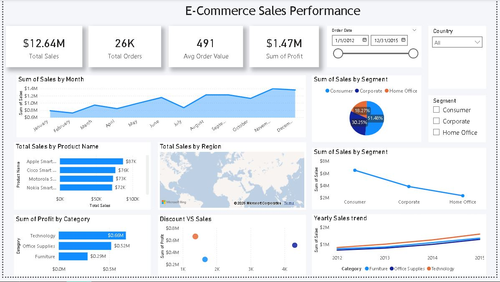

# Global Superstore Power BI Dashboard

## Overview
This project contains an interactive Power BI dashboard built using Global Superstore data.

## Features
- KPI cards (Sales, Profit, Orders)
- Discount vs Profit analysis
- Yearly Sales Trend
- Region, Segment, Category slicers
- Drill-through functionality

## Tools Used
- Power BI Desktop
- DAX
- GitHub
- Excel

## File
- Global_Superstore_Dashboard.pbix

#### Dashboard

